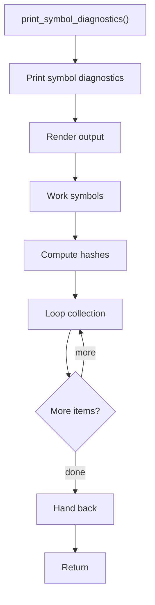

# print_symbol_diagnostics.cpp

- Source document: [syntacticBrokenAST.cpp.md](../../syntacticBrokenAST.cpp.md)
- Purpose: decoupled implementation logic for a future code unit.

### print_symbol_diagnostics()
This routine materializes internal state into an output format that later stages can consume.

Inside the body, it mainly handles render or serialize the result, work with symbol-oriented state, compute hash metadata, and walk the local collection.

The implementation iterates over a collection or repeated workload.

What it does:
- render or serialize the result
- work with symbol-oriented state
- compute hash metadata
- walk the local collection

Flow:

