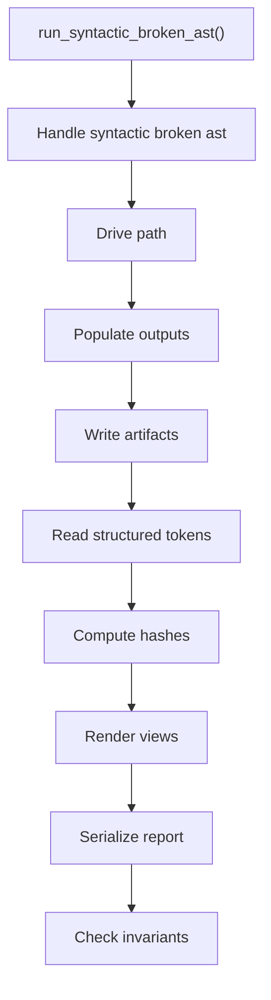
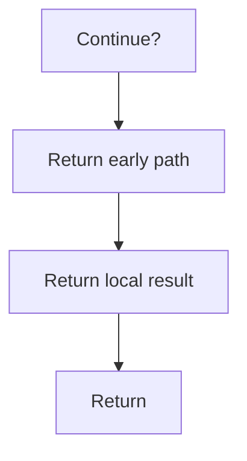

# run_syntactic_broken_ast.cpp

- Source document: [syntacticBrokenAST.cpp.md](../../syntacticBrokenAST.cpp.md)
- Purpose: decoupled implementation logic for a future code unit.

### run_syntactic_broken_ast()
This routine prepares or drives one of the main execution paths in the file.

Inside the body, it mainly handles drive the main execution path, fill local output fields, write generated artifacts, and read local tokens.

The implementation iterates over a collection or repeated workload. It branches on runtime conditions instead of following one fixed path. The caller receives a computed result or status from this step.

What it does:
- drive the main execution path
- fill local output fields
- write generated artifacts
- read local tokens
- compute hash metadata
- render text or HTML views
- serialize report content
- validate pipeline invariants
- walk the local collection
- branch on local conditions

Flow:

### Block 6 - run_syntactic_broken_ast() Details
#### Slice 1 - Continue Local Flow

#### Slice 2 - Continue Local Flow

