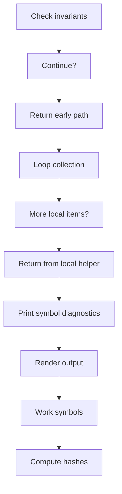
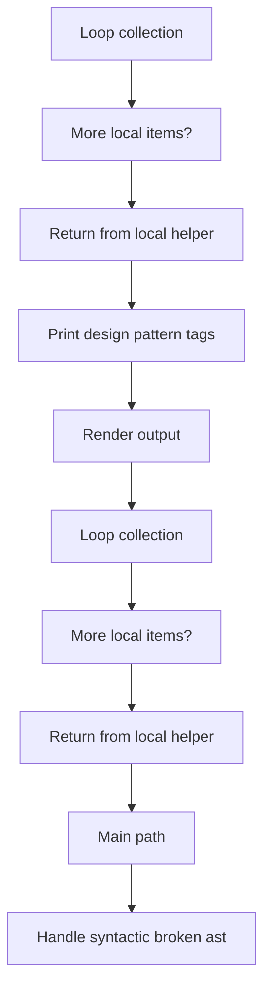
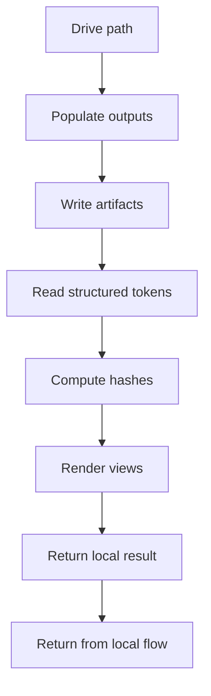

# syntacticBrokenAST_program_flow_02.cpp

- Source document: [syntacticBrokenAST.cpp.md](../syntacticBrokenAST.cpp.md)
- Purpose: decoupled implementation logic for a future code unit.

#### Slice 9 - Continue Local Flow

#### Slice 10 - Continue Local Flow

#### Slice 11 - Continue Local Flow

