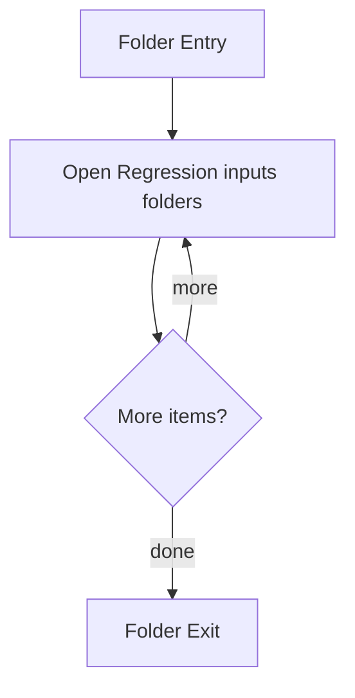

# Test

- Folder: docs/Codebase/Microservice/Test
- Descendant source docs: 5
- Generated on: 2026-04-23

## Logic Summary
Validation-oriented source corpus and test support assets.

## Subsystem Story
This folder mainly acts as a navigation layer. Use it to understand how the deeper child folders divide the subsystem into smaller concerns.

## Folder Flow

## Child Folders By Logic
### Regression Inputs
These child folders continue the subsystem by covering Regression-focused input programs used to exercise specific transform and detection routes.
- Input/ : Regression-focused input programs used to exercise specific transform and detection routes.

## Reading Hint
- Use the child folder groups to navigate deeper into this subsystem.

