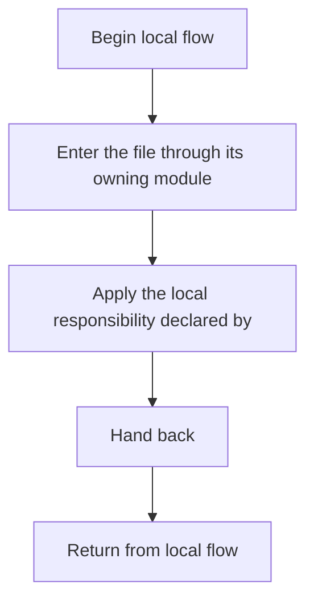

# Notes

- Source: Notes
- Kind: Project note

## Story
### What Happens Here

This file participates in the NeoTerritory implementation as a focused artifact with a narrow local responsibility. Its behavior is best understood by reading it in the context of the module that loads or compiles it.

### Why It Matters In The Flow

This artifact participates in the repository flow according to the surrounding module or toolchain that loads it.

### What To Watch While Reading

Keeps loose repository-level notes outside the formal docs set.

## Program Flow
This diagram follows the action path in plain words. Decision diamonds show where the file can stop, branch, or repeat work instead of simply passing through a straight line.

## Reading Map
Read this file as: Keeps loose repository-level notes outside the formal docs set.

Where it sits in the run: This artifact participates in the repository flow according to the surrounding module or toolchain that loads it.

## Documentation Note
- This markdown file is part of the generated docs/Codebase mirror.
- It was generated from the repository state on 2026-04-23 after reading the existing docs corpus and the current source tree.

